<div align="center">


# TrueMark
### Secure Digital Truth in a Synthetic World

*A multi-module digital forensics and privacy application designed for academic and practical use in high-risk media authenticity scenarios.*

<br />


</div>

<br />

> [!NOTE]
> **TrueMark** is a comprehensive capstone project completed in March 2026 at **VIT Bhopal University**. It integrates cryptography, steganography, and metadata analysis into a single workflow so users can prove ownership, protect confidential files, and reduce accidental forensic leakage.

---

## 📑 Table of Contents

<details open>
<summary><b>Click to Expand/Collapse</b></summary>
<br>

- 🌍 [**Project Vision**](#-project-vision)
- ✨ [**Key Capabilities & Modules**](#-key-capabilities--modules)
- 📸 [**App Gallery**](#-app-gallery)
- 📂 [**Project Directory Structure**](#-project-directory-structure)
- 🏗️ [**System Architecture**](#️-system-architecture)
- 🛡️ [**Security & Cryptography Model**](#️-security--cryptography-model)
- ⚙️ [**Setup & Build Guide**](#️-setup--build-guide)
- 📄 [**Academic Reports & Syllabi**](#-academic-reports--syllabi)
- 🎓 [**Academic Origins & Team**](#-academic-origins--team)

</details>

---

## 🌍 Project Vision

TrueMark addresses a modern trust problem: in a synthetic media ecosystem, visual evidence alone is no longer enough. The platform is built around three core principles:
1. **Authenticity:** Prove media ownership and tamper resistance.
2. **Confidentiality:** Protect payloads in transport and at rest.
3. **Operational Safety:** Reduce metadata leaks and handling errors.

---

## ✨ Key Capabilities & Modules

| Module | Primary Input | Primary Output | Core Security Method | Main Use Case |
| :--- | :--- | :--- | :--- | :--- |
| **TrueSign** | Image + Identity Metadata | Signed image artifact | Encrypted LSB steganographic watermark | Ownership proof & authenticity tracking |
| **TrueLock** | Any file format | Encrypted `.tmk` container | AES-256-CBC with PKCS7 padding | Confidential transfer & secure archival |
| **TrueHide** | Cover media + hidden payload | Stego output carrier | Covert payload embedding | Low-visibility data transport |
| **TrueMeta** | Media file | Sanitized file | EXIF metadata parsing & scrubbing | Privacy protection & leak prevention |
| **TrueVault**| Internal App Artifacts | Managed vault entries | Controlled in-app storage boundary | Secure evidence chain-of-custody |

---

## 📸 App Gallery

<div align="center">
  <table>
    <tr>
      <td>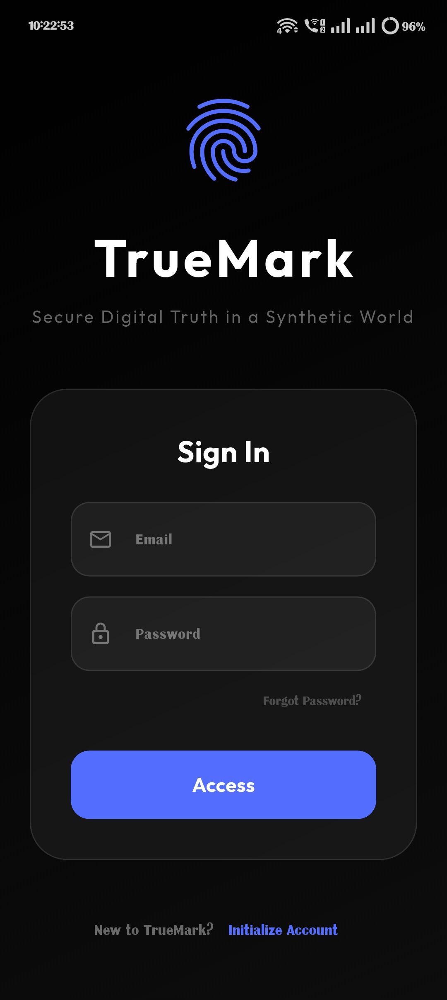</td>
      <td>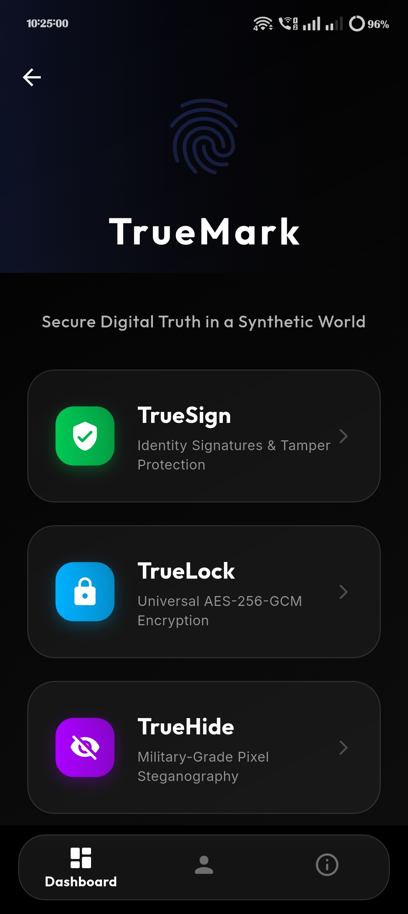</td>
      <td>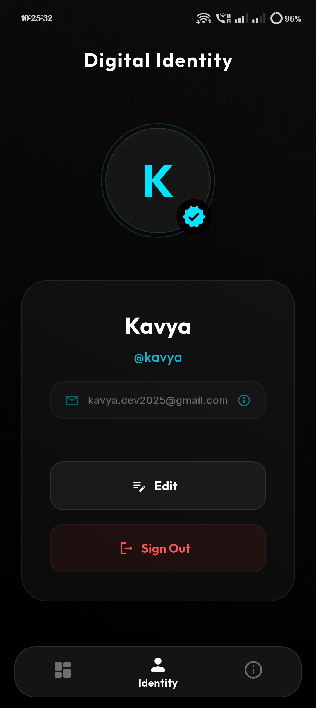</td>
    </tr>
    <tr>
      <td>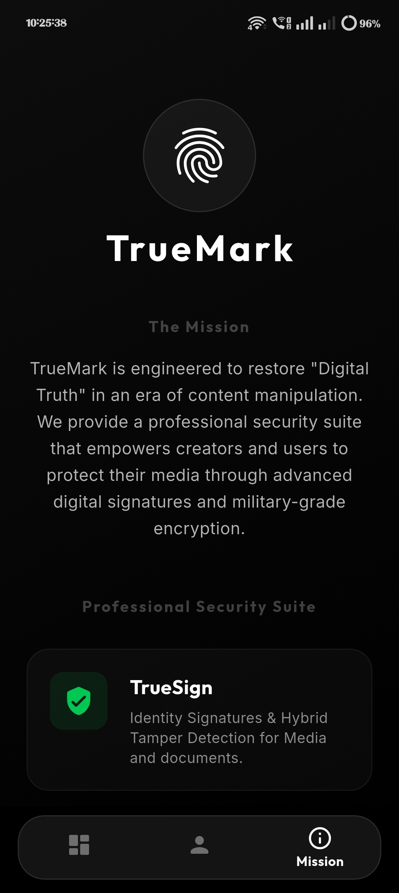</td>
      <td>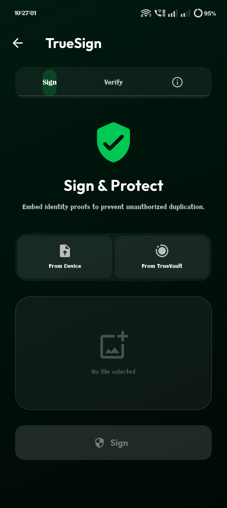</td>
      <td>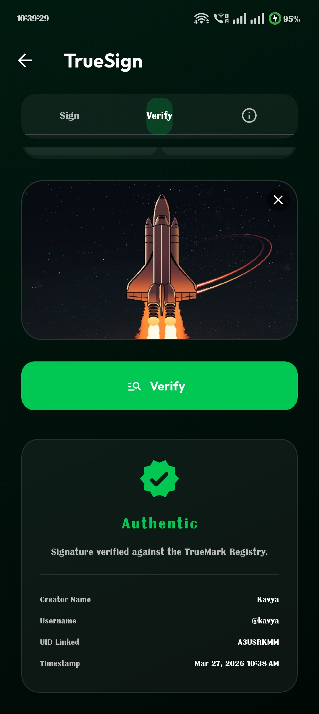</td>
    </tr>
    <tr>
      <td>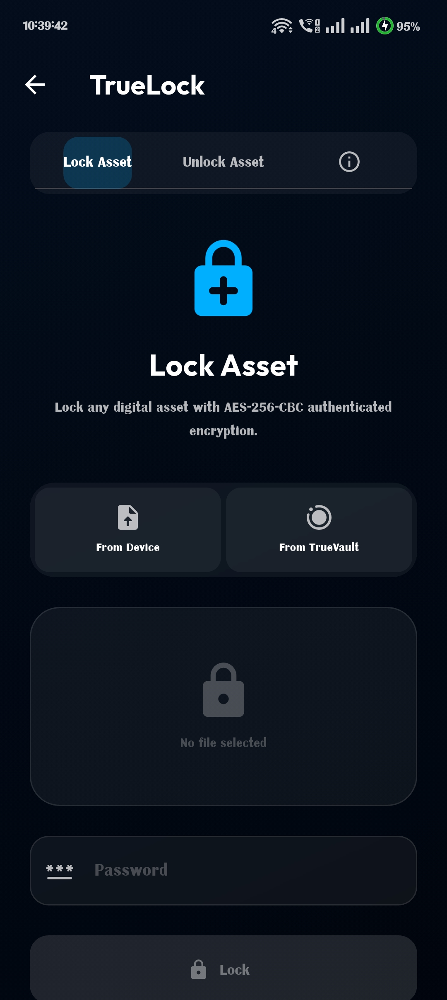</td>
      <td>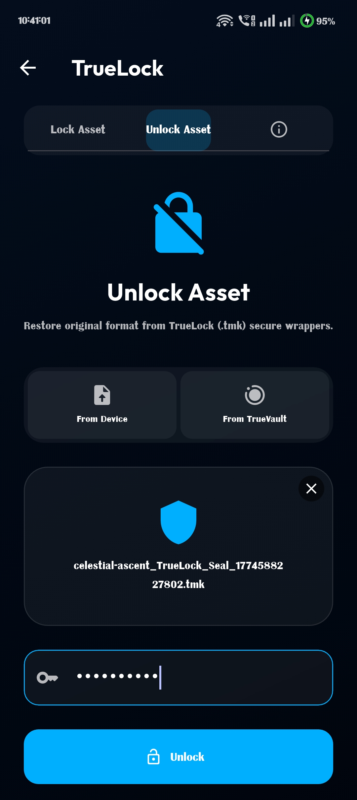</td>
      <td>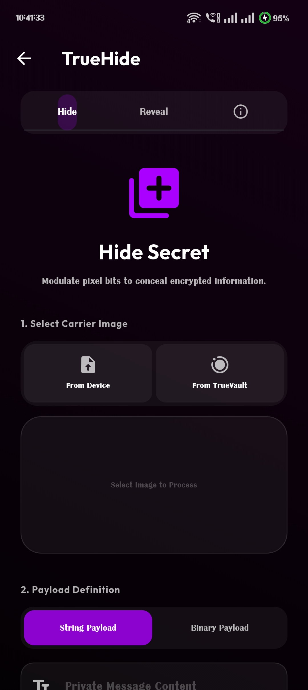</td>
    </tr>
    <tr>
      <td>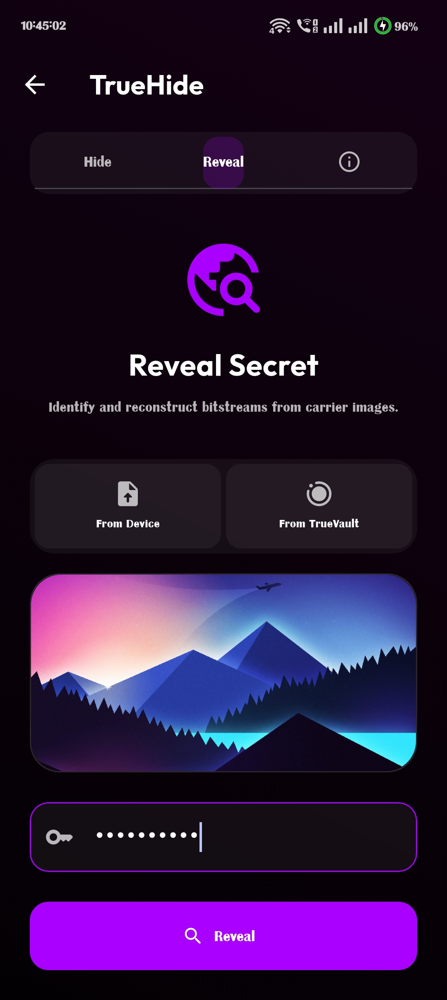</td>
      <td>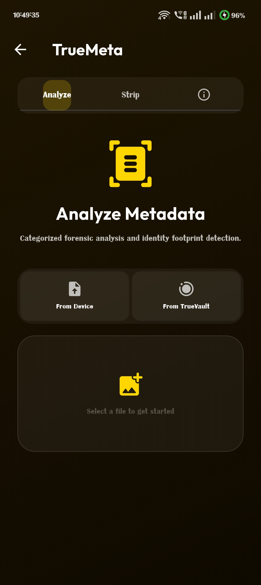</td>
      <td>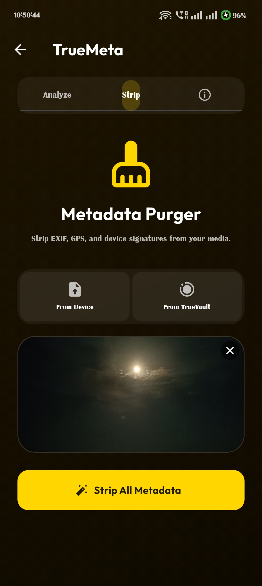</td>
    </tr>
    <tr>
      <td>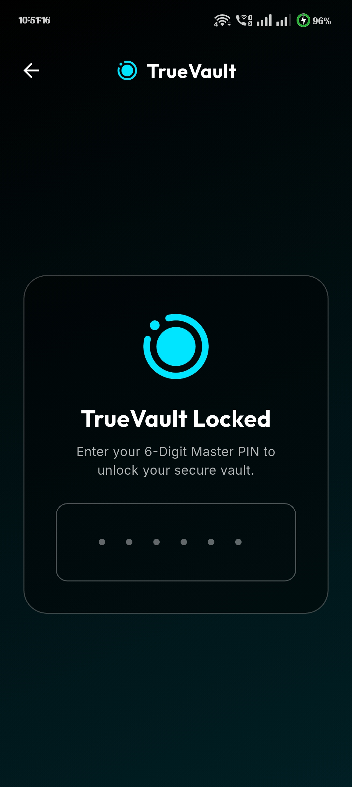</td>
      <td>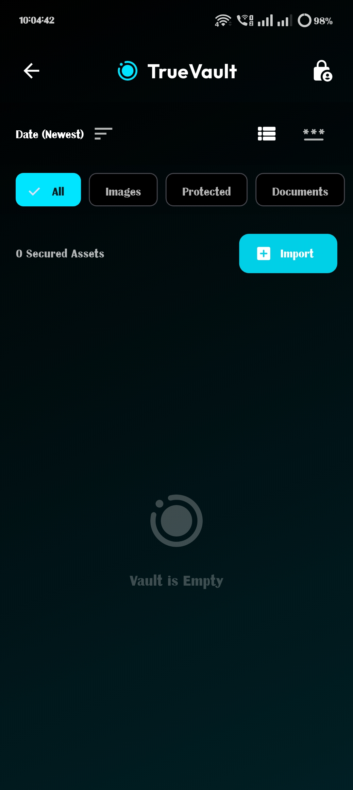</td>
      <td>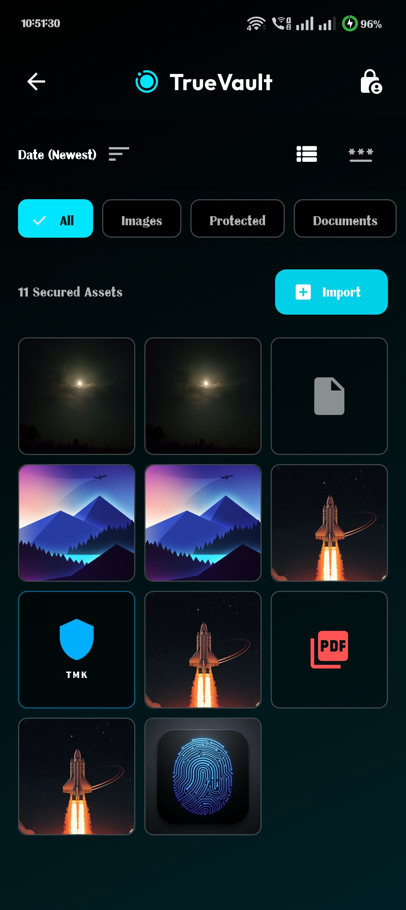</td>
    </tr>
  </table>
</div>

<br/>

👉 **[View Full Screenshot Gallery (All Modules)](docs/screenshots/)**

---

## 📂 Project Directory Structure

```text
📦 TrueMark
 ┣ 📂 android/                 # Native Android embedding and Gradle configurations
 ┣ 📂 assets/
 ┃ ┗ 📂 images/                # App icon, branding graphics, and UI placeholders
 ┣ 📂 dist/                    # Compiled release artifacts (.apk, .exe)
 ┣ 📂 docs/
 ┃ ┣ 📂 academic/              # Capstone documentation, syllabi, and reports
 ┃ ┗ 📂 screenshots/           # Comprehensive gallery of the app's interface
 ┣ 📂 lib/                     # Core Flutter Application Code
 ┃ ┣ 📂 models/                # Strongly-typed data contracts
 ┃ ┣ 📂 screens/               # Feature-isolated UI views
 ┃ ┃ ┣ 📜 true_lock_screen.dart
 ┃ ┃ ┣ 📜 true_sign_screen.dart
 ┃ ┃ ┗ 📜 ...
 ┃ ┣ 📂 services/              # Core cryptographic and processing logic
 ┃ ┃ ┣ 📜 true_lock_service.dart  # AES-256 implementation
 ┃ ┃ ┣ 📜 steg_service.dart       # LSB steganography engine
 ┃ ┃ ┗ 📜 image_service.dart      # EXIF parsing and manipulation
 ┃ ┣ 📂 widgets/               # Reusable components and Win32 custom frame
 ┃ ┗ 📜 main.dart              # Entry point, Firebase init, and routing
 ┣ 📂 windows/                 # Custom Win32 native wrapper setup
 ┣ 📜 firebase.json            # Firebase CLI routing configuration
 ┣ 📜 pubspec.yaml             # Dart dependencies and asset declarations
 ┗ 📜 LICENSE                  # MIT License with custom exclusions
```

---

## 🏗️ System Architecture

TrueMark is designed using a feature-first, layered architecture prioritizing modularity, security, and scalability.

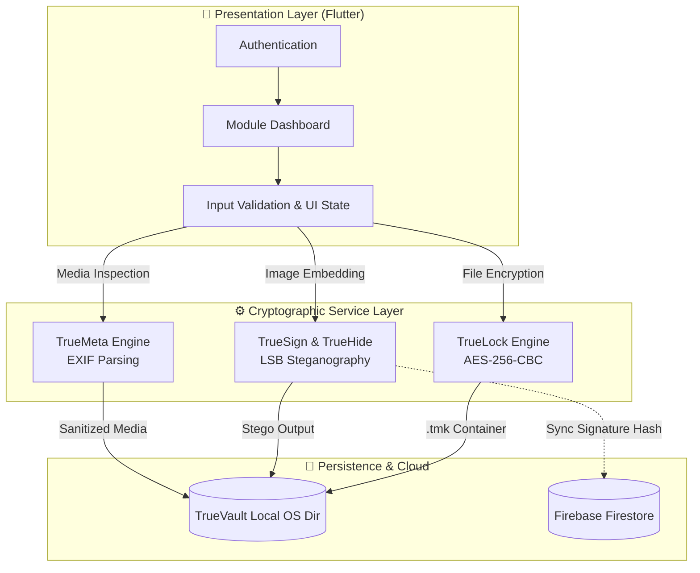

### 1. Data Flow and State Management

1. **User Action**: The user initiates a secure action (e.g., encrypting a file via `TrueLockScreen`).
2. **UI Validation**: The UI checks for file presence, non-empty passwords, and valid extensions.
3. **Service Invocation**: The Screen delegates the byte manipulation to the `TrueLockService`. The heavy cryptographic lifting happens asynchronously.
4. **Vault Persistence**: Once the file is processed (locked, signed, or scrubbed), it is written to the device's secure Application Documents Directory (`TrueVault`).
5. **Registry Sync (Optional)**: For TrueSign, ownership signatures are synced with Firebase Firestore to ensure cross-device verification capability.

### 2. Platform Layering

- **Android (`android/`)**: Standard Flutter Android embedding using Gradle build chains. The Firebase configuration is bound natively.
- **Windows (`windows/`)**: Custom Win32 embedding. TrueMark utilizes `window_manager` to strip away the default OS borders and draw a custom Flutter app bar, forcing fixed resolutions for a consistent forensic desktop experience.

---

## 🛡️ Security & Cryptography Model

TrueMark employs multiple layers of digital security to ensure data confidentiality, authenticity, and operational safety.

### 1. TrueLock (Confidentiality)

TrueLock provides secure containerization for files. It converts raw file bytes into encrypted `.tmk` containers.

**Cryptographic Specifications:**
- **Algorithm**: Advanced Encryption Standard (AES)
- **Key Size**: 256-bit
- **Mode of Operation**: Cipher Block Chaining (CBC)
- **Padding Scheme**: PKCS7
- **Key Derivation**: SHA-256 (Fast, synchronous derivation optimized for mobile hardware).
- **Initialization Vector (IV)**: 16-byte cryptographically secure random bytes generated per encryption.

**File Structure (`.tmk` Container):**
- **Header**: 5 bytes (`TMK09`) for versioning and legacy compatibility.
- **IV**: 16 bytes.
- **Extension Length**: 1 byte.
- **Extension Data**: Variable (Restores original format on decryption).
- **Ciphertext**: The AES encrypted file bytes.

### 2. TrueSign & TrueHide (Authenticity & Steganography)

TrueMark utilizes **Least Significant Bit (LSB)** steganography to embed data inside image carriers.

**Mechanism:**
1. The service reads the raw RGB byte arrays of the carrier image.
2. The payload (ownership signature or hidden file) is converted to a binary stream.
3. The LSBs of the carrier's pixel channels are systematically flipped to encode the payload.
4. **Capacity Constraints**: The app estimates maximum safe capacity before writing to prevent visual distortion or file corruption.

*Note: In TrueSign, the signature string is AES-encrypted before being embedded, preventing unauthorized extraction or tampering by third parties analyzing the LSBs.*

### 3. TrueMeta (Privacy)

TrueMeta acts as a forensic scrubber to prevent metadata leakage.
- Parses `EXIF` data to expose hidden camera serials, GPS coordinates, and timestamps.
- Repackages the image bytes into a clean slate, removing the EXIF headers before generating a safe output for sharing.

### 4. TrueVault (Storage Boundary)

Files processed by TrueMark are stored in the OS-provided Application Documents directory.
- Bypasses public indexing (like Android's MediaStore or Windows generic Downloads).
- Enforces predictable naming conventions to preserve chain-of-custody.

---

## ⚙️ Setup & Build Guide

This guide covers how to set up TrueMark for local development and build release artifacts.

### Prerequisites
- **Flutter SDK**: `^3.8.1` (stable channel recommended)
- **Dart SDK**: Required alongside Flutter.
- **Android**: Android Studio, Android SDK, and standard Gradle build tools.
- **Windows**: Visual Studio 2022 with the "Desktop development with C++" workload installed.

### 1. Initial Setup

Clone the repository and install dependencies:
```bash
git clone <repository-url>
cd TrueMark
flutter pub get
```

Generate the launcher icons across platforms:
```bash
dart run flutter_launcher_icons
```

### 2. Firebase Configuration

TrueMark relies on Firebase for Authentication and Firestore (Signature verification). Ensure you have the Firebase CLI installed:
```bash
npm install -g firebase-tools
dart pub global activate flutterfire_cli
```

Log in and configure your project:
```bash
firebase login
flutterfire configure
```
*Select your preferred Firebase project, and choose Android and Windows as the target platforms.*

> [!IMPORTANT]
> The committed Firebase config files in this repository are example templates only. If you build from source, copy `lib/firebase_options.example.dart` to `lib/firebase_options.dart` locally, copy `android/app/google-services.json.example` to `android/app/google-services.json`, and fill in your own Firebase values on your machine only.

## 🔐 Security: Handling Exposed API Keys (What you must do)

If API keys have already been committed but you need the released APK and ZIP/EXE to keep working, follow these exact safe steps **in this order**. Do not delete the old key until you've verified the new settings work with your released artifacts.

1. Backup release artifacts

  - Ensure the released `.apk` and `.zip` (containing `.exe`) are stored in GitHub Releases or another safe storage location.

2. Create a new API key (optional but recommended)

  - In Google Cloud Console → APIs & Services → Credentials → Create credentials → API key.
  - Name it `truemark-release-YYYYMMDD` for clarity.

3. Restrict the new key and the existing key

  - Under the key's **Application restrictions** set:
    - Android apps: add package name `com.example.truemark` and the release signing certificate SHA-1 used to sign your released `.apk`.
    - iOS apps: add the app bundle id if applicable.
  - Under **API restrictions** restrict to only the APIs used (e.g., `Firebase`, `Cloud Firestore`, `Identity Toolkit`).

  Important: Keep the old key active while you validate the new key. If the released APK/EXE must continue to use the old key, keep it enabled with the tightened API restrictions.

4. Verify keys and logs

  - In Google Cloud Console → APIs & Services → Dashboard, monitor the usage of both keys for unusual traffic.
  - In Firebase Console → Project Settings → Service accounts / App Check, enable App Check for supported services to reduce abuse.

5. How to get the release SHA-1 (exact commands)

  - From release keystore:

    ```bash
    keytool -list -v -keystore /path/to/keystore.jks -alias your_alias
    ```

  - From a signed APK file:

    ```bash
    keytool -printcert -jarfile app-release.apk
    ```

  Use the SHA-1 value when adding Android app restrictions so the released APK continues to work.

6. EXE / Desktop apps

  - Desktop EXEs cannot be restricted by app signature. Options:
    - Leave an API key with API-only restrictions (monitor usage) for the EXE, or
    - Implement a small server-side proxy that authenticates the EXE (recommended for long-term security).

7. Final step (after verification)

  - Once you've verified the new key and restrictions, you may safely delete the older key.
  - Optionally, scrub the repository history to remove leaked files (use BFG or git-filter-repo). This rewrites history and requires collaborators to re-clone.

---


### 3. Building for Production

#### Android Release
To build a highly optimized release APK:
```bash
flutter build apk --release
```
The resulting artifact will be located at:
`build/app/outputs/flutter-apk/app-release.apk`

#### Windows Release
To build the native Win32 executable:
```bash
flutter build windows --release
```
The executable will be located at:
`build/windows/x64/runner/Release/truemark.exe`

### Troubleshooting

- **Windows Build Lock**: If building for Windows fails due to a locked `build_trash` or `build` folder, close any running instances of TrueMark, stop Dart background processes, and run `flutter clean`.
- **Firebase Duplicate App Error**: Handled automatically in `main.dart`, but ensure your `firebase_options.dart` perfectly matches your active project.

---

## 🎓 Academic Origins & Capstone Context

This repository represents the final year Capstone Project submission for **VIT Bhopal University**. 
Engineered and completed in **March 2026**, the project was executed across two rigorous academic phases:

* **DSN4091** - Capstone Project Phase 1
* **DSN4092** - Capstone Project Phase 2

### Official Documentation

All academic artifacts are stored in the [`docs/academic/`](docs/academic/) directory.

* **Project Reports:** Detailed documents covering methodology, system architecture, testing procedures, and contribution breakdowns.
* **Presentations:** The official slide decks presented during the final Capstone defenses.
* **Course Syllabi:** The official university curriculum outlines dictating the project requirements and constraints.

👉 **Browse Documents:** **[Phase 1 Directory](docs/academic/phase-1/)** &nbsp;|&nbsp; **[Phase 2 Directory](docs/academic/phase-2/)**

---

## 📥 Downloads & Releases

While the repository structure has evolved to include comprehensive academic and architectural documentation, the core source code remains unchanged from the final build. 
You can directly download the fully compiled application binaries from our GitHub Releases:

👉 **[Download TrueMark v2.0.0 (Android APK & Windows ZIP)](https://github.com/Varaxion/TrueMark/releases/tag/v2.0.0)**

---

## 📄 License

This project is licensed under the **MIT License**.

> **Note**: Academic reports, presentations, slide decks, UI mockups, and custom branding assets located within the `docs/` directory are **explicitly excluded** from the open-source license and remain the intellectual property of the original authors.

---

### 👥 Credits

Engineered by students of Group-5, Capstone Project, B.Tech. CSE (Core), VIT Bhopal University, class of 2026.

| Member | Registration No. | Primary Role |
| :--- | :--- | :--- |
| **[Jit Surani](https://github.com/JitSurani)** | `22BCE10354` | 🛡️ System Architect |
| **[Rushabh Wagh](https://github.com/wrexrus)** | `22BCE10364` | ⚙️ Backend Developer |
| **[Kavya](https://github.com/Varaxion)** | `22BCE10385` | 🎨 Frontend Developer |
| **[Tejas Pathak](https://github.com/tejas-0-5)** | `22BCE10853` | ☁️ Cloud Engineer |
| **[Simarpreet Singh](https://github.com/Simarpreet-2607)** | `22BCE10914` | 🔬 QA Engineer |

<br />

<div align="center">
  <em>TrueMark • Engineered for Digital Truth.</em>
</div>
