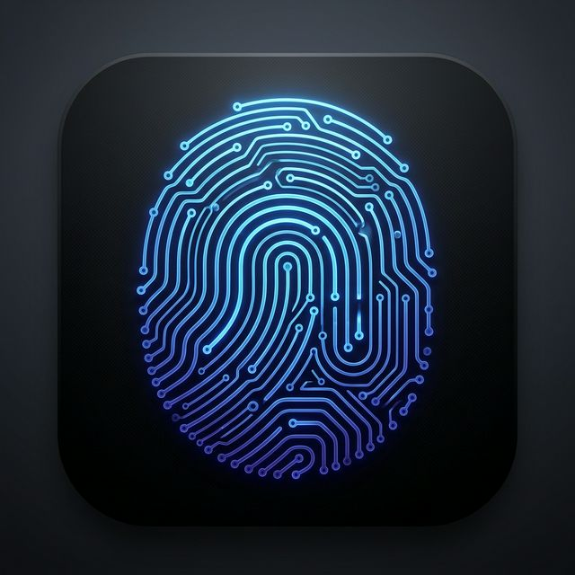
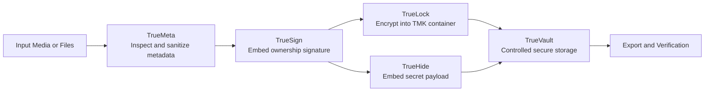

<p align="center">
	
</p>

# TrueMark
## Secure Digital Truth in a Synthetic World.

<p align="center">
	
	
	
	
</p>

**Version 2.0.0**

TrueMark is a multi-module digital forensics and privacy application designed for academic and practical use in high-risk media authenticity scenarios. It integrates cryptography, steganography, and metadata intelligence into a single workflow so users can prove ownership, protect confidential files, and reduce accidental forensic leakage.

The project addresses a modern trust problem: in a synthetic media ecosystem, visual evidence alone is no longer enough. TrueMark introduces cryptographically informed controls that preserve authenticity and traceability while remaining usable for students, researchers, and operational teams.

## Table of Contents
- Visual Snapshot
- Project Vision
- Key Capabilities
- Feature Matrix
- Architecture Flow
- Module Architecture
- End-to-End Workflow
- TrueVault Storage Model
- Security and Cryptography Notes
- Platform Support
- Tech Stack
- Project Structure
- Setup and Configuration
- Build and Release
- Troubleshooting
- Limitations and Future Work

## Visual Snapshot

| Security | Trust | Privacy | Platform |
|---|---|---|---|
| AES-256-CBC | Ownership Signature | EXIF Sanitization | Android + Windows |
| TMK Encapsulation | Verification Pipeline | Covert Embedding | Release Artifacts |

## Architecture Flow



## Project Vision
TrueMark is built around three principles:
- Authenticity: prove media ownership and tamper resistance.
- Confidentiality: protect payloads in transport and at rest.
- Operational Safety: reduce metadata leaks and handling errors.

The core objective is to create an explainable, auditable media security pipeline that can be demonstrated in capstone environments and scaled to real operational contexts.

## Key Capabilities
- Invisible ownership signing with encrypted steganographic payloads.
- AES-based file sealing into TMK secure containers.
- Covert payload embedding with capacity checks.
- Metadata inspection and EXIF sanitization before sharing.
- Centralized output handling through a secure in-app vault.
- Cross-platform distribution for Android and Windows.

## Feature Matrix
| Module | Primary Input | Primary Output | Core Security Method | Validation/Guardrails | Main Use Case |
|---|---|---|---|---|---|
| TrueSign | Image + ownership metadata | Signed image artifact | Encrypted LSB steganographic watermark | Signature generation and verification workflow | Ownership proof and authenticity tracking |
| TrueLock | Any supported file bytes | Encrypted `.tmk` container | AES-256-CBC with PKCS7 padding | Deterministic decrypt path, legacy `TMK01` compatibility | Confidential transfer and secure archival |
| TrueHide | Cover media + hidden payload | Stego output carrier | Covert payload embedding with key-based reveal | Capacity estimation before embedding | Low-visibility payload transport |
| TrueMeta | Image/media file | Metadata report + sanitized file | Forensic metadata parsing and scrub pipeline | Human-readable metadata inspection before export | Privacy protection and leak prevention |
| TrueVault | Generated app artifacts | Auditable managed vault entries | Controlled in-app storage boundary | Naming convention and time-based ordering | Chain-of-custody-friendly artifact management |

## Module Architecture

### 1. TrueSign (Image Ownership and Verification)
TrueSign embeds identity and context data into image content using LSB steganography.

What it does:
- Encodes ownership metadata into image pixels with minimal visible distortion.
- Wraps payload data with encryption prior to embedding.
- Supports verification flow to confirm authenticity claims.

Why it matters:
- Enables practical proof-of-origin for images.
- Helps detect forged or unsigned media in sharing pipelines.

### 2. TrueLock (Secure Containerization)
TrueLock converts regular files into encrypted TMK blocks.

What it does:
- Encrypts file bytes with AES-256-CBC and PKCS7 padding.
- Produces locked .tmk output for transport or archival.
- Restores the original byte stream after correct-key decryption.
- Preserves compatibility with legacy TMK01 blocks.

Why it matters:
- Prevents direct inspection of sensitive payloads.
- Creates a reproducible and auditable lock-unlock cycle.

### 3. TrueHide (Covert Payload Embedding)
TrueHide conceals one file inside another media carrier.

What it does:
- Embeds secondary payloads into supported cover files.
- Estimates maximum safe capacity before write.
- Blocks overflow scenarios that would corrupt output.

Why it matters:
- Enables low-visibility data transport in constrained channels.
- Improves reliability by validating capacity before execution.

### 4. TrueMeta (Metadata Forensics and Sanitization)
TrueMeta examines and removes privacy-sensitive metadata.

What it does:
- Extracts EXIF and related metadata for user inspection.
- Removes location, device, and timestamp traces when required.
- Generates safer output for publication or sharing.

Why it matters:
- Reduces accidental location/device exposure.
- Strengthens operational hygiene in evidence workflows.

## End-to-End Workflow
Typical recommended sequence:
1. Acquire or import source media.
2. Inspect metadata with TrueMeta.
3. Sign ownership with TrueSign when authenticity is required.
4. Lock sensitive files with TrueLock if confidentiality is required.
5. Use TrueHide for covert transport only when needed.
6. Store outputs in TrueVault and export final artifacts.

## TrueVault Storage Model
TrueVault acts as a secure in-app storage boundary for generated artifacts.

Design goals:
- Keep output handling predictable and auditable.
- Avoid common SAF indexing and write inconsistencies.
- Maintain stable naming for traceability.

Naming convention:
[OriginalName]_[Feature]_[Operation]_[Timestamp].[Ext]

Operational notes:
- View mode preferences are persisted across sessions.
- Time-based sorting uses vault add/modified timestamps.

## Security and Cryptography Notes
- Encryption mode: AES-256-CBC.
- Padding: PKCS7.
- Key-related hashing/derivation paths use SHA-256 where applicable.
- Verification and registry paths integrate with Firebase Firestore.

Important:
- Strong passphrases remain essential to practical security.
- Covert and cryptographic protections do not replace legal chain-of-custody procedures.

## Platform Support
- Android: release APK generation supported.
- Windows: release EXE generation supported.

## Tech Stack
- Flutter and Dart
- Firebase Auth and Firestore
- Image and metadata processing libraries
- Local secure storage utilities
- Windows desktop packaging toolchain

## Project Structure
```text
TrueMark/
|- lib/
|  |- main.dart                      # Entry point, routing shell, theme/bootstrap
|  |- firebase_options.dart          # Generated Firebase platform config
|  |- models/                        # Domain models and typed data contracts
|  |  |- ...                         # Vault item metadata, result DTOs, etc.
|  |- services/                      # Core business logic and security primitives
|  |  |- true_lock_service.dart      # TMK encrypt/decrypt engine (AES, container logic)
|  |  |- steg_service.dart           # LSB hide/extract + capacity estimation
|  |  |- firestore_rest_service.dart # Registry/verification sync paths
|  |  |- ...                         # File handling, metadata, utility services
|  |- providers/                     # App/session state and dependency wiring
|  |  |- ...                         # View mode/state persistence providers
|  |- screens/                       # Feature-first presentation layer
|  |  |- login_screen.dart           # Authentication entry flow
|  |  |- signup_screen.dart          # Account creation flow
|  |  |- true_sign_screen.dart       # Ownership signing and verification UI
|  |  |- true_lock_screen.dart       # Encrypt/decrypt UI for TMK containers
|  |  |- true_hide_screen.dart       # Covert embedding/extraction UI
|  |  |- true_meta_screen.dart       # Metadata inspection/sanitization UI
|  |  |- true_vault_screen.dart      # Secure in-app file explorer
|  |  |- ...
|  |- widgets/                       # Reusable UI building blocks
|  |  |- windows_frame.dart          # Windows desktop frame wrapper
|  |  |- ...
|  |- utils/                         # Shared helpers, constants, formatting tools
|     |- ...
|- assets/
|  |- images/
|     |- appIcon.png                 # Primary app icon (Android + Windows)
|- android/                          # Android Gradle project and native runner
|  |- app/
|  |  |- src/                        # Android manifest/resources/Kotlin runner files
|  |  |- google-services.json        # Firebase Android configuration
|  |- build.gradle.kts               # Project-level Gradle configuration
|  |- gradle.properties              # JVM/Kotlin/Android build toggles
|  |- settings.gradle.kts
|- windows/                          # Windows runner, CMake and app resources
|  |- runner/                        # Native Win32 host app source/resources
|  |- flutter/                       # Generated platform glue
|  |- CMakeLists.txt                 # Windows native build definition
|- test/                             # Widget/unit tests
|- pubspec.yaml                      # Dependencies, assets, icon generation config
|- analysis_options.yaml             # Dart analyzer and linting rules
|- firebase.json                     # Firebase project-level settings
|- README.md                         # Project documentation
```

### Layering and Responsibility
- UI layer (`lib/screens`, `lib/widgets`): renders module workflows, validates user input, and delegates operations to services.
- Application state layer (`lib/providers`): tracks session and view preferences, enabling persistent UX state.
- Domain layer (`lib/models`): strongly typed data contracts used between screens and services.
- Service layer (`lib/services`): handles encryption, steganography, metadata workflows, vault persistence, and Firebase integration.
- Platform layer (`android`, `windows`): native runner, build tooling, and platform-specific packaging.

### Navigation and Data Flow (High Level)
1. User action starts in a screen (`lib/screens`).
2. Screen validates input and invokes service methods (`lib/services`).
3. Services process bytes/files and return typed results (`lib/models`).
4. Providers persist state/view preferences where needed (`lib/providers`).
5. Final artifacts are stored and surfaced in TrueVault.

## Setup and Configuration

### Prerequisites
- Flutter SDK (stable channel)
- Android SDK and build tools
- Visual Studio 2022 with Desktop development for C++
- Firebase project configuration for authentication and registry features

### Initial Setup
1. Clone repository.
2. Install dependencies.
3. Ensure Firebase config files are present.
4. Generate launcher icons.

Commands:
```bash
flutter pub get
dart run flutter_launcher_icons
```

## Build and Release

### Android Release
```bash
flutter build apk --release
```
Output path:
- build/app/outputs/flutter-apk/app-release.apk

### Windows Release
```bash
flutter build windows --release
```
Output path:
- build/windows/x64/runner/Release/truemark.exe

### Artifact Copy (Optional)
```powershell
Copy-Item -Force "build\app\outputs\flutter-apk\app-release.apk" "TrueMark.apk"
Copy-Item -Force "build\windows\x64\runner\Release\truemark.exe" "TrueMark.exe"
```

## Troubleshooting

### Locked build folders on Windows
If build cleanup fails due to file locks:
1. Stop Java, Gradle, and Flutter processes.
2. Run Gradle daemon stop.
3. Retry cleanup and build.

### Kotlin incremental cache failures
If release builds fail with incremental cache close/root mismatch issues:
- Disable Kotlin incremental compilation in android/gradle.properties.
- Clear android/.gradle and rebuild.

### Launcher icon config issues
For flutter_launcher_icons v0.13.x, Windows config must be a map instead of a boolean.

## Limitations and Future Work
Current limitations:
- Signature robustness depends on image post-processing pipeline.
- Capacity constraints vary by carrier format and size.
- Some operations are optimized for the current supported formats.

Future directions:
- Stronger resilience testing across aggressive image transforms.
- Expanded forensic reporting and verification dashboards.
- Additional platform support and CI-based release automation.

---
© 2026 TrueMark. Engineered for Digital Truth.
